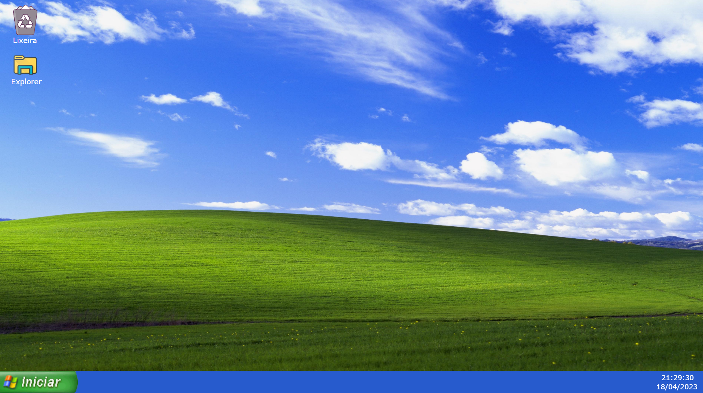

https://rafaelsantosmp4.github.io/Windows-XP/

## Screen 📱

## About ✔
Windows XP was a project carried out for studies/training of HTML, CSS and Javascript carried out at the request of the master at ETEC in Poá.

Those involved in the project are:

- Caio Custodio Parolin
- Leonardo Moreira Nakashima Monteiro
- Rafael Santos Rodrigues
- Rebeca Martins Caroba
